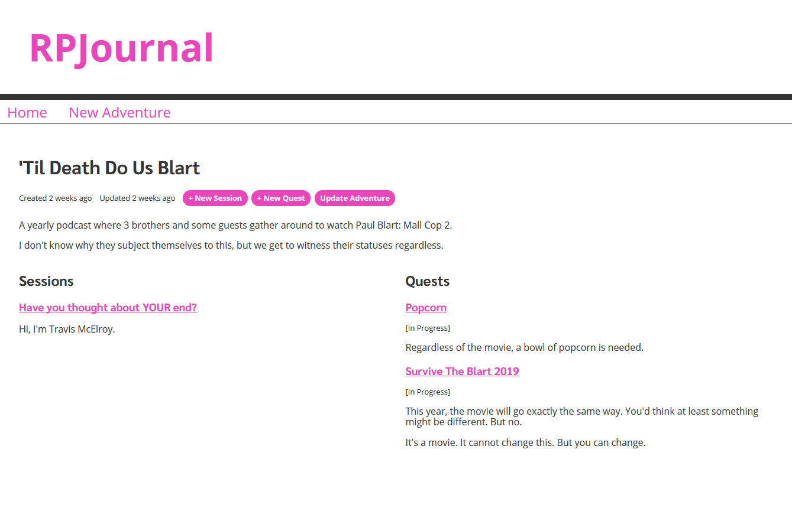

## Past Situations

So I've been regularly playing tabletop role-playing games for a couple of years - with the occasional breaks. Some breaks have gone for up to to 6 weeks. Since we didn't really keep much notes outside of our character sheets, we had try to remember by scrolling up through our previous chat logs to make sense of the current plot.

That worked during the year and a half that the campaign lasted. I only wished we recorded _more_ of the funny moments we said only over voice chat.

About 6 months passed, and I really wanted to get into another campaign. My other friend was excited to be our dungeon master for our local friend group!

## Little Wishes for Improvement

This time around, he asked that someone be the note-taker for our sessions. Given that I had a lot of spare paper lying around, I took... _initiative_ and offered to do it. While I wouldn't say these notes were exhaustive, they did help a lot months into our campaign.

As the notes spanned over about a dozen pages, I wanted to move towards a more compact format. I spent a couple days transferring my notes to a single Google Docs file with the same structure as my college class lectures. It's still my current solution, since I became very effecient with the learned shortcuts.

Although I am largely satisfied with typing it all out, I still find myself needing to keep a couple sheets and sticky notes at my side. I'm perfectly fine keeping my character's inventory on paper; that's always shifting. It's the other details like quests, NPCs, sketches/pictures, etc. I didn't want to maintain additional small files. I also wanted all this information to flow together well, like in many story-driven RPGs.

## Prototype

After going through Wes Bos's [Advanced React](https://advancedreact.com/) course, I decided to plan out my own solution for this need. Although my dependencies differ slightly from the course, the concepts really let me accelerate the process.

The application centers around three types of models: _Adventures_, _Sessions_, and _Quests_. Adventures are the main model that reference an RPG campaign or story, as well as the sessions and quests for it. The screenshot above shows the initial presentation of an Adventure page.

At this point, there's the usual create, read, and update functions for each data model. I put off deleting until after user authentication is added. I'm happy with the potential for this after setting up the basic version.

## Later Plans

I planned a break between the prototype and the "phase II" start date so that I can use it and think about improvements. I'm definitely going to modify some actions to flow a little nicer, like creating and updating sessions. I'm not going to list all of my tasks here, but I am putting them in a GitHub [project page](https://github.com/MarkH817/RPJournal/projects/2). I'll write about it more once that phase is done and deployable somewhere.
